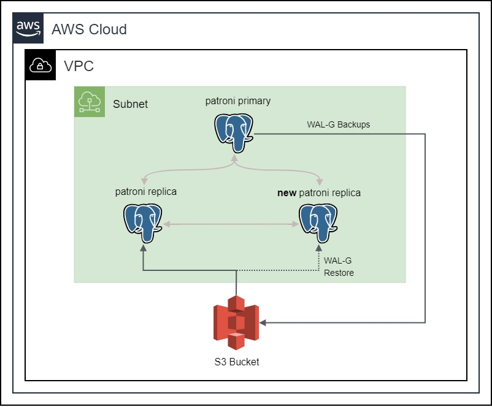

# Backing up and Restoring a Highly Available PostgreSQL Cluster with S3 Bucket



In our previous blog posts, [Setting up a highly available PostgreSQL Cluster with Patroni using Spilo Image](./blog-Running_Spilo.md), we embarked on a journey to set up a highly available PostgreSQL cluster managed by Patroni using the Spilo image. We saw how Patroni, in collaboration with an etcd cluster, elevates PostgreSQL to new heights of availability and failover automation. Building upon that, let's explore the next chapter in our journey: backing up and restoring a highly available PostgreSQL cluster with an S3 bucket.

## Why S3 bucket?

In a highly available PostgreSQL cluster, it is important to have a backup of the database. The backup can be used to restore the database in case of a disaster. The backup can also be used to create new replicas, instead of streaming the data directly from the primary node. This is useful when the primary node is under heavy load, and we want to create a new replica without affecting the performance of the primary node.

The backup can be stored in a file system or in an S3 bucket. The advantage of using an S3 bucket is that it is highly available and durable. According to the [AWS documentation](https://aws.amazon.com/s3/storage-classes/?nc1=h_ls), the standard S3 bucket is designed to deliver 99.999999999% durability and 99.99% availability of objects over a given year. This means that the S3 bucket is highly available and durable. It is also easy to set up and configure, since Spilo provides a way to automatically create WAL-E / WAL-G backups and store them in an S3 bucket. We will be using this feature to store the backups in an S3 bucket.

## Setting up the S3 Bucket

Now let's see how we can set up an S3 bucket for our PostgreSQL cluster. We will be using the [AWS S3 Bucket](https://docs.aws.amazon.com/AmazonS3/latest/userguide/Welcome.html) for this purpose.

The first step is to create a new S3 Bucket. We will create a new S3 Bucket called `patroni-demo-bucket`. We can use the following Ansible task to create the S3 Bucket:

```yaml
- name: Ensure that a S3 Bucket for WAL backups exists
  amazon.aws.s3_bucket:
    name: "patroni-demo-bucket
    state: present
    region: "{{ instance_region }}"
    tags:
        Name: patroni-demo-bucket
        env: demo
    register: s3_bucket
```

The next step is to create a new IAM Role that will be used by the EC2 instances running the Spilo image to access the S3 bucket. The IAM Role should have specific permissions to access the S3 bucket. We can use the following Ansible task to create the IAM Role and its permissions:

```yaml
- name: Create IAM Role for Patroni WAL
  community.aws.iam_role:
    name: PatroniWALRole
    state: present
    region: "{{ instance_region }}"
    assume_role_policy_document: "{{ lookup('file', './assume_role_policy.json')|string }}"
    tags:
        Name: PatroniWALRole
        env: demo
    register: iam_role

- name: Save the IAM Role ARN to a file
    ansible.builtin.shell: echo "\nAWS_ROLE_ARN={{ iam_role.arn }}" >> ../tmp/patroni-env # Will be used by Spilo

- name: Create instance profile for Patroni WAL
  amazon.aws.iam_instance_profile:
    name: PatroniWALInstanceProfile
    state: present
    region: "{{ instance_region }}"
    role: "{{ iam_role.role_name }}"
    tags:
        Name: PatroniWALInstanceProfile
        env: demo
    register: iam_instance_profile

- name: Attach S3 Policy to Patroni WAL Role
  amazon.aws.iam_policy:
    policy_name: PatroniWALPolicy
    iam_type: role
    iam_name: "{{ iam_role.role_name }}"
    state: present
    region: "{{ instance_region }}"
    policy_json : "{{ lookup('file', './patroni-wal-role-policy.json')|string }}"
```

Notice that we are using the `assume_role_policy_document` parameter to specify on which resources the IAM Role can be assumed. In our case, we will be using the EC2 instances running the Spilo image. We are also using the `policy_json` parameter to specify the permissions that the IAM Role will have. In our case, we will be using the permissions provided by the `patroni-wal-role-policy.json` file. The permissions in the file are the minimum permissions required to access the S3 bucket. To get the details about the permissions, you can visit to our [GitHub repository](https://github.com/proventa/aws-postgresql-demo).

## Putting the S3 Bucket and Spilo Together

Now, let's see how we can put the S3 bucket and Spilo together. We can take the systemd unit file from the [previous blog post](./blog-Running_Spilo.md) and modify it to include the S3 bucket. The modified systemd unit file should look like this:

```yaml
... # Omitted for brevity
ExecStart=/usr/bin/podman \
    run \
    --rm \
    --net=host \
    --name patroni-container \
    --volume /etc/ssl/self-certs:/etc/ssl/self-certs \
    --volume ${HOME}/patroni:/home/postgres/pgdata \
    --env SCOPE=superman \
    --env PGVERSION=15 \
    --env ETCD3_PROTOCOL="https" \
    --env ETCD3_HOSTS="${ETCD_HOSTS}" \
    --env ETCD3_CACERT="/etc/ssl/self-certs/proventa-root-ca.pem" \
    --env ETCD3_CERT="/etc/ssl/self-certs/proventa-client-cert.pem" \
    --env ETCD3_KEY="/etc/ssl/self-certs/proventa-client-cert-key.pem" \
    --env AWS_REGION="eu-central-1" \ # The region in which the S3 bucket is located
    --env WAL_S3_BUCKET="patroni-demo-bucket" \ # The name of the S3 bucket
    --env AWS_ROLE_ARN="${AWS_ROLE_ARN}" \ # The ARN of the IAM Role
    --env USE_WALG_BACKUP="true" \ # Enable WAL-G backups
    --env USE_WALG_RESTORE="true" \ # Enable WAL-G restore
    ghcr.io/zalando/spilo-15:3.0-p1

... # Omitted for brevity
```

We are specifying the `AWS_REGION`, `WAL_S3_BUCKET`, and `AWS_ROLE_ARN` environment variables. The `AWS_REGION` environment variable specifies the region in which the S3 bucket is located. The `WAL_S3_BUCKET` environment variable specifies the name of the S3 bucket. The `AWS_ROLE_ARN` environment variable specifies the ARN of the IAM Role. The IAM Role will be used by the EC2 instances running the Spilo image to access the S3 bucket.

## Verifying the WAL backups on the S3 Bucket

Now, let's check if the backups are actually being stored in the S3 bucket. We can do so by navigating to the AWS console and selecting the `patroni-demo-bucket` S3 bucket. We should see a new folder called `spilo` in the S3 bucket. The folder should contain a folder with the name of your Patroni cluster and inside that folder, we should see the WAL-G backups. 

We can also check if the backups are being stored in the S3 bucket by running the following command on your terminal:

```bash
aws s3 ls s3://patroni-demo-bucket/spilo/superman --recursive --human-readable --summarize
```

The output should look like this:

```bash
2023-09-01 09:08:08  192 Bytes spilo/superman/wal/15/wal_005/000000010000000000000002.00000060.backup.lz4
2023-09-01 09:08:07    2.9 KiB spilo/superman/wal/15/wal_005/000000010000000000000002.lz4
...
```

With that we can see that the backups are being stored in the S3 bucket.


## Wrapping Up

We have explored the process of creating backups for a highly available PostgreSQL cluster using an S3 bucket. This method offers the advantage of ensuring high availability and durability of backups. We've covered the steps for setting up the S3 bucket, creating an IAM Role with the necessary permissions, and integrating it with the Spilo image.

By following these steps, you can confidently secure your PostgreSQL data and be prepared for disaster recovery scenarios. Storing backups in an S3 bucket provides a reliable and robust solution to safeguard your critical database data. We hope this guide has been informative and assists you in implementing effective backup strategies for your PostgreSQL cluster.
