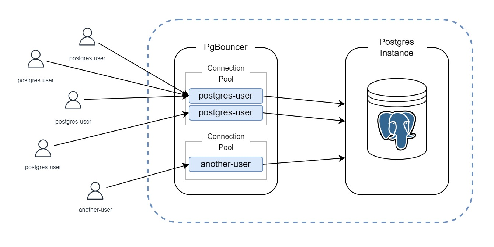

# Setting up a Connection Pooler for PostgreSQL on EC2 Instances



In the world of database management, PostgreSQL stands tall as a powerful and reliable open-source relational database system. However, as database workloads grow, efficient connection management becomes crucial for maintaining performance and scalability. This is where connection poolers like PgBouncer come into play.

In this blog post, we'll explore the setup and configuration of PgBouncer—a lightweight connection pooler—for PostgreSQL on Amazon EC2 instances. PgBouncer acts as an intermediary between your application and the database, efficiently managing database connections.

## Prerequisites

Make sure you have followed the steps in our previous blog post, [Setting up a highly available PostgreSQL Cluster with Patroni using Spilo Image](./blog-Running_Spilo.md), to set up PostgreSQL on your EC2 instances. We'll be using the same instances for this blog post.

## Why Use PgBouncer?

Managing database connections can be resource-intensive. Each connection consumes memory and other resources on the database server. When your application requires numerous connections, this can lead to performance bottlenecks. PgBouncer addresses this issue by pooling and reusing database connections, resulting in significant improvements in efficiency and scalability.

Before we dive into the technical details, let's take a look at the configuration file and systemd unit file that will enable us to set up PgBouncer for PostgreSQL on Fedora CoreOS.

## The Configuration File

The following is the systemd unit configuration for our PgBouncer service, which can be added to the Butane configuration file from the previous blog post:

```yaml
# ... Configurations from the previous blog post

- name: pgbouncer.service
  enabled: true
  contents: |
    [Unit]
    Description=PgBouncer Connection pooling with Podman

    [Service]
    User=patroni-user
    Restart=always
    RestartSec=5s
    TimeoutStartSec=0
    LimitNOFILE=40000

    ExecStartPre=/usr/local/bin/prepare_pgbouncer_auth.sh patroni-container postgres postgres
    ExecStartPre=/usr/bin/podman rm -f pgbouncer-container
    ExecStart=/usr/bin/podman \
      run \
      --rm \
      --net=host \
      --name pgbouncer-container \
      --volume /etc/ssl/self-certs:/opt/bitnami/pgbouncer/certs \
      --volume /usr/local/share/userlist.txt:/opt/bitnami/pgbouncer/userlist.txt \
      --env DB_HOST="localhost" \
      --env DB_NAME="postgres" \
      --env DB_PORT="5432" \
      --env AUTH_USER="pgbouncer" \
      --env AUTH_QUERY="SELECT username, password FROM pgbouncer.get_auth($1)" \
      --env STATS_USERS="stats_collector" \
      --env AUTH_FILE="/opt/bitnami/pgbouncer/userlist.txt" \
      --env AUTH_TYPE="scram-sha-256" \
      --env LISTEN_PORT="6432" \
      --env CLIENT_TLS_SSLMODE="require" \
      --env CLIENT_TLS_KEY_FILE="/opt/bitnami/pgbouncer/certs/proventa-client-cert-key.pem" \
      --env CLIENT_TLS_CERT_FILE="/opt/bitnami/pgbouncer/certs/proventa-client-cert.pem" \
      --env CLIENT_TLS_CA_FILE="/opt/bitnami/pgbouncer/certs/proventa-root-ca.pem" \
      docker.io/edoburu/pgbouncer:1.20.1-p0

    ExecStop=/usr/bin/podman rm -f pgbouncer-container

    [Install]
    WantedBy=multi-user.target

# ... Configurations from the previous blog post
```

The above configuration will run the PgBouncer container, and expose the PgBouncer service on port `6432`. The PgBouncer itself will connect to the PostgreSQL DB with the parameters we specified in `DB_HOST`, `DB_NAME`, and `DB_PORT`. Connections from the end-user to the PgBouncer will be secured using TLS with the self-signed certificates generated with a script that can be found in our Github repository [here](https://github.com/proventa/aws-postgresql-demo/blob/main/scripts/generate-client-cert.sh).

On the first step, we run a script called `prepare_pgbouncer_auth.sh`. Here, we are creating a database user that will be used by PgBouncer to verify whether incoming connections are allowed or not. The script is as follows:

```bash
#!/bin/bash

PG_ISREADY="podman exec -it $1 pg_isready -U $2 -d $3"

until $PG_ISREADY
do
  echo "Waiting for postgres to start..."
  sleep 5
done

cat <<EOF | podman exec -it $1 psql -U $2 -d $3
CREATE SCHEMA IF NOT EXISTS pgbouncer;

REVOKE ALL PRIVILEGES ON SCHEMA pgbouncer FROM pgbouncer;

GRANT USAGE ON SCHEMA pgbouncer TO pgbouncer;

CREATE OR REPLACE FUNCTION pgbouncer.get_auth(username TEXT)
RETURNS TABLE(username TEXT, password TEXT) AS \$\$ 
SELECT rolname::TEXT, rolpassword::TEXT 
FROM pg_authid 
WHERE pg_authid.rolcanlogin AND
pg_authid.rolname <> 'pgbouncer' AND
(pg_authid.rolvaliduntil IS NULL OR pg_authid.rolvaliduntil >= CURRENT_TIMESTAMP) AND
pg_authid.rolname = \$1; 
\$\$ LANGUAGE SQL STABLE SECURITY DEFINER;

REVOKE ALL ON FUNCTION pgbouncer.get_auth(username TEXT) FROM PUBLIC, pgbouncer;

GRANT EXECUTE ON FUNCTION pgbouncer.get_auth(username TEXT) TO pgbouncer;
EOF

echo "PgBouncer Auth Preparation Complete"

exit 0
```

First it waits until the PostgreSQL instance is ready to accept connections. Then it creates a database user called `pgbouncer`.
The user `pgbouncer` is granted with a very limited set of privileges. It can only connect to the database and execute the `get_auth` function. This function is used by PgBouncer to verify whether incoming connections are allowed or not.

After the script is successfully executed, we can specify the `pgbouncer` user as an `AUTH_USER` in the systemd unit configuration.

In the systemd unit configuration, we are specifying the `AUTH_QUERY` with the value `SELECT username, password FROM pgbouncer.get_auth($1)`. This means that PgBouncer will execute the `pgbouncer.get_auth` function with the username provided by the client. If the function returns a row, then the connection is allowed. Otherwise, the connection is rejected.

Then we have the `STATS_USERS` parameter. This parameter specifies the users that are allowed to execute the `SHOW STATS` command. The information returned will be useful and can be used to monitor the PgBouncer service. In our case we are using a user called `stats_collector`.

Finally we have `AUTH_FILE`. This parameter specifies the location of the `userlist.txt` file. This file contains the username and password of the users that are allowed to connect to the database. In our setup (which is a very simple setup), the file contains the following:

```
"pgbouncer" "pgbouncer"
"stats_collector" "collector_stats"
```

Users in this file are allowed to connect to the database and will not be queried against the `pgbouncer.get_auth` function.

Now that we have covered the systemd unit configuration, we can ready to deploy the EC2 instances with our new configuration file. However, we still need to change an entry in our Security Group task. Since we are now using PgBouncer on port 6432, we wouldn't want to expose port 5432 that is used by the Postgres DB. Instead, we will expose the port 6432. Here's the updated version of the Security Group task in the `network_conf-task.yml` file:
```yaml
# ... Configurations from the previous blog post
- name: Ensure that the security group exists
  amazon.aws.ec2_security_group:
    name: "Postgres Demo SG"
    description: "Security group for Postgres Demo"
    vpc_id: "{{ vpc_net.vpc.id }}"
    region: "{{ instance_region }}"
    rules:
      - proto: tcp
        ports:
          - 22
        cidr_ip: "0.0.0.0/0"
      - proto: tcp
        from_port: 2379
        to_port: 2380
        cidr_ip: "10.0.1.0/24"
      - proto: tcp
        ports:
          - 8008
        cidr_ip: "10.0.2.0/24"
      - proto: tcp
        from_port: 2379
        to_port: 2380
        cidr_ip: "10.0.2.0/24"
      - proto: tcp
        ports:
          - 5432
        cidr_ip: "10.0.2.0/24"
      - proto: tcp
        ports:
          - 6432 # PgBouncer port instead of 5432
        cidr_ip: "0.0.0.0/0"
    state: present
    tags:
      env: demo
  register: sg
# ... Configurations from the previous blog post
```
We now have everything set up and ready to go. Let's deploy the instances by using the same Ansible script from the previous blog post to deploy the instances.


## Verifying the Connection Pooler

Once the instances are up and running, we can SSH into one of the instances and check the status of the PgBouncer service by running the following command:

```bash
podman logs pgbouncer-container
```

You should see a response similar to the following:

```bash
Starting /usr/bin/pgbouncer /etc/pgbouncer/pgbouncer.ini...
2023-09-15 15:08:47.052 UTC [1] LOG kernel file descriptor limit: 40000 (hard: 40000); max_client_conn: 100, max expected fd use: 132
2023-09-15 15:08:47.056 UTC [1] LOG listening on 0.0.0.0:6432
2023-09-15 15:08:47.056 UTC [1] LOG process up: PgBouncer 1.20.1, libevent 2.1.12-stable (epoll), adns: udns 0.4, tls: OpenSSL 3.0.10 1 Aug 2023
2023-09-15 15:08:47.593 UTC [1] LOG C-0x7faa970ea060: pgbouncer/stats_collector@127.0.0.1:44796 login attempt: db=pgbouncer user=stats_collector tls=TLSv1.3/TLS_AES_256_GCM_SHA384
...
```

Now that we have verified that the PgBouncer service is running, we can test the connection by connecting to the database using the `psql` command with `postgres` as the username and `zalando` as the (default) password:

```bash
psql -h <ec2-instance-public-ip> -p 6432 -U postgres -d postgres
```

Or you can also connect to the database as the `stats_collector` user to be able to run the `SHOW STATS` commands. The password of this user is defined in the `userlist.txt` file (In our case now it's `collecter_stats`). We can do this by running the following command:

```bash
psql -h <ec2-instance-public-ip> -p 6432 -U stats_collector -d pgbouncer
```

After entering the correct password, you should see a response similar to the following:

```bash
psql (14.0)
Type "help" for help.

postgres=> # Or pgbouncer=> if you are logged in as the stats_collector user
```

With that we have verified that the PgBouncer service is running and that we can connect to the database using the PgBouncer service.

## Wrapping Up

In this blog post, we've explored the essential concept of using PgBouncer, a connection pooler, to enhance the efficiency and scalability of your PostgreSQL database on EC2 instances. We've learned how to set up and configure PgBouncer to act as a intermediary layer between your application and the database server, managing connections seamlessly.

By following the detailed steps and configurations outlined in this blog post, you've taken a significant step towards optimizing your PostgreSQL setup for high-performance and scalability. With PgBouncer in place, you can confidently manage your database connections while maintaining a secure and efficient PostgreSQL environment.

We hope this guide has been informative and that it simplifies your journey in harnessing the full potential of PostgreSQL!