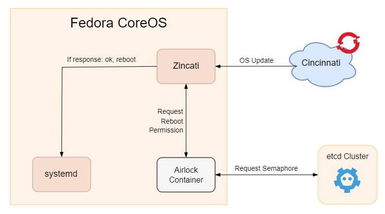

# Coordinating OS Update on Multiple Fedora CoreOS Machines



Fedora CoreOS is a lightweight, container-focused operating system. It is designed to be updated automatically and frequently with atomic updates. This means that the entire operating system is updated as a whole, including the kernel. This is a great feature for keeping your system up to date and secure, but it can be a challenge to coordinate updates across multiple machines. There are some use cases where you want to coordinate when a system is updated. For example, if you have a 3 node database cluster, you would not want to update (which requires a reboot) all of the machines at the same time. This would cause downtime for your database. Instead, you would want to update one machine at a time, so that the database can fail over to another machine while the first machine is being updated. In this blog post, we will learn how to coordinate OS updates across multiple Fedora CoreOS machines with the help of etcd and Airlock.

# Prerequisites

- An `etcd` cluster, which will be used by Airlock to coordinate the OS updates. We have a blog post about how to set up an etcd cluster [here](./blog-etcd_Cluster.md).
- Two or more Fedora CoreOS machine that will be used to run Airlock. In this case we will use the machines running Spilo container image. The guide to set up Spilo on Fedora CoreOS can be found [here](./blog-Running_Spilo.md).

# Airlock Configuration

Airlock is a tool that can be used to coordinate OS updates across multiple Fedora CoreOS machines. It is a simple tool that uses etcd to coordinate the updates. It is available as a container image, so it can be run on any container runtime.

Airlock needs a .toml file for its configuration. We can use the following `config.toml` file for our setup:

```toml
# Status service configuration
[status]
enabled = true
address = "localhost" # Can be changed to private / public IP of the machine
port = 2222
tls = false

# Main service configuration
[service]
address = "localhost" # Can be changed to private / public IP of the machine
port = 3333
tls = false

# Etcd-v3 client configuration
[etcd3]
endpoints = [ "http://10.0.1.33:2379","http://10.0.1.34:2379" ] # Replace with your etcd endpoints
client_cert_pub_path = "/etc/ssl/self-certs/proventa-client-cert.pem"
client_cert_key_path = "/etc/ssl/self-certs/proventa-client-cert-key.pem"

# Lock configuration, base reboot group
[lock]
default_group_name = "default"
default_slots = 2

# Additional reboot groups
[[lock.groups]]
name = "patroni"
slots = 1
```

The `status` section configures the status service, which is used to check the status of the machine. This endpoint will be useful for the monitoring the airlock status with the help of Prometheus and Grafana.

The `service` section configures the main service, which is used to coordinate the OS updates. In this endpoint `Zincati` will send a FleetLock request to check if the machine can be rebooted for an update. FleetLock protocol is a request-response protocol based on HTTP, with which Zincati can request a lock for rebooting the machine. The response will be either `OK` or `BUSY`. If the response is `OK`, then the machine can be rebooted. If the response is `BUSY`, then the machine cannot be rebooted.

The `etcd3` section configures the etcd cluster that will be used by Airlock. We can specify the ip addresses of our etcd cluster in the `endpoint` section. Since our etcd uses TLS, we have configured the paths to the client certificate and key.

The `lock` section configures the lock that will be used by Airlock to coordinate the OS updates. Per default Zincati belongs to the group `default`. Therefore, we will specify `default` as the name of the `default_group_name`, which will be used as a default group name by Airlock. The `default_slots` is the number of machines that can be updated at the same time. The `[[lock.groups]]` section can be used to configure additional groups. In this case, we have configured a group called `patroni` with 1 slot. This means that only one machine in the `patroni` group can take the lock and do the OS update at a time.

## Zincati Configuration

Now that we have configured the Airlock config.toml file, we need to configure Zincati to use Airlock. We can do this by adding the following lines to `/etc/zincati/config.d/55-updates-strategy.toml` file:

```toml
[updates]
strategy = "fleet_lock"
[updates.fleet_lock]
base_url = "http://127.0.0.1:3333" # Change to the address of the Airlock service
```

And to specify the group that will be used by Zincati, we can add the following lines to `/etc/zincati/config.d/90-custom-identity.toml` file:

```toml
[identity]
group = "patroni"
```

## Running Airlock

Airlock and Zincati have been configured. Now we can run Airlock on our Fedora CoreOS machines. We can add the following systemd unit file configuration to the existing Butane file for our Postgres cluster from the previous blog post:

```yaml
- name: airlock.service
  enabled: true
  contents: |
    [Unit]
    Description=airlock with Podman

    [Service]
    User=patroni-user
    Restart=always
    RestartSec=5s
    TimeoutStartSec=0
    LimitNOFILE=40000

    ExecStartPre=/usr/bin/loginctl enable-linger patroni-user
    ExecStartPre=/usr/local/bin/prepare-airlock.sh
    ExecStartPre=/usr/bin/podman rm -f airlock-container
    ExecStart=/usr/bin/podman \
    run \
    --rm \
    --net=host \
    --name airlock-container \
    --volume=/etc/ssl/certs:/etc/ssl/certs \
    --volume=/etc/ssl/self-certs:/etc/ssl/self-certs \
    --volume=${HOME}/airlock-config.toml:/etc/airlock/config.toml \
    quay.io/coreos/airlock:main \
    airlock serve -vv
    ExecStop=/usr/bin/podman rm -f airlock-container

    [Install]
    WantedBy=multi-user.target
```

There are no special configurations in this unit file. We are just mounting the `config.toml` file that we created earlier and running the Airlock container with the `airlock serve -vv` command.

After that, we can run the ansible-playbook from the previous blog post to provision the machines.

## Testing Airlock

After the machines are provisioned and Airlock is running, we can test the Airlock service.

First we need the id of the machine. You can get the id of the machine by running the following command:

```bash
cat /etc/machine-id
```

An example of the output is:

```bash
2204af7f41984cb19b8cde4edc06c142
```

After that, we need to create a JSON file for the FleetLock request. We can create a file called `body.json` with the following content:

```json
{
  "id": "2204af7f41984cb19b8cde4edc06c142",
  "group": "patroni"
}
```

Lastly, we can send the FleetLock request to the Airlock service with the following command:

```bash
curl -H "fleet-lock-protocol: true" -d @body.json http://127.0.0.1:3333/v1/pre-reboot
```

Then, we can check the log of the Airlock container to see the response by running the following command to see the logs:

```bash
podman logs airlock-container
```

An example of the output is:

```bash
time="2023-09-26T12:58:45Z" level=debug msg="got pre-reboot request"
time="2023-09-26T12:58:45Z" level=debug msg="processing client pre-reboot request" group=patroni id=2204af7f41984cb19b8cde4edc06c142
time="2023-09-26T12:58:45Z" level=debug msg="givin green-flag to pre-reboot request" group=patroni id=2204af7f41984cb19b8cde4edc06c142
```

In this case, the response is `green-flag`, which means that the machine can be rebooted.

However, if the output is like the following:

```bash
time="2023-09-26T15:03:16Z" level=error msg="failed to lock semaphore: all 1 semaphore slots currently locked"
```

Then the response is a `red-flag`, which means that the machine cannot be rebooted and the lock is currently being used by another machine. You can produce this response by changing the id of the machine in the `body.json` file and sending the request again.

## Conclusion

In this blog post, we learned how to coordinate OS updates across multiple Fedora CoreOS machines with the help of etcd and Airlock. We also learned how to configure Airlock and Zincati to use Airlock. Lastly, we learned how to test the Airlock service.