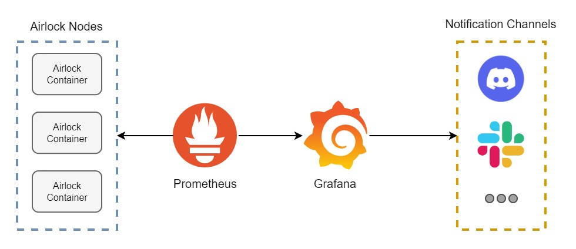

# Get Notified: Setting Up Alerts in Grafana



If you are using Grafana to monitor your systems, you are already ahead of the game. But did you know that you can also use Grafana to set up alerts? This is a great way to get notified when something goes wrong with your systems. In this blog post, we will show you how to set up alerts in Grafana so that you can be notified when something does not align with the rules you have set up for your system.

## Prerequisites

- Services, which metrics you want to monitor. In this case, we will monitor the `Airlock` service from our [previous blog post](./blog-Coordinated_OS_Updates.md).
- A running instance of Grafana and Prometheus. If you don't have one, you can follow our [guide](./blog-Prometheus-Grafana.md) to set up a Grafana and Prometheus on an EC2 instance.
- A dashboard with the metrics you want to monitor. If you are also using the `Airlock` service, you can use the dashboard we created that can be found [here](https://github.com/proventa/aws-postgresql-demo/blob/main/grafana-dashboards/airlock.json).

## Setting up alerts

### Step 1: Create a notification channel

First, we need to create a notification channel. This is where Grafana will send the alerts. To do this we can either navigate through the Grafana UI or use an Ansible module, like we did on [one of our previous blog posts](./blog-Prometheus-Grafana.md). However, this time we will use the `grafana_notification_channel` module from the [community.grafana](https://galaxy.ansible.com/community/grafana) collection. We will create a notification channel for a Discord server. To do this, we can use the following Ansible task:

```yaml
- name: Create Discord notification channel
  community.grafana.grafana_notification_channel:
    type: discord
    uid: discord
    name: Discord Notification Channel
    discord_url: "{{ grafana_discord_url }}"
    grafana_url: "http://{{ item }}:3000/"
    grafana_user: "admin"
    grafana_password: "{{ grafana_password}}"
  with_items: "{{ monitoring_public_ip }}"
```

Make sure to replace `grafana_discord_url` with your Discord webhook URL. You can find the Discord webhook URL in the [Discord webhook settings](https://support.discord.com/hc/en-us/articles/228383668-Intro-to-Webhooks) page. Also, make sure to replace `monitoring_public_ip` with the public IP of your monitoring instance and `grafana_password` with the password of your Grafana instance.

After running the task, we can see that the notification channel has been created.


### Step 2: Create an alert

Now that we have created a notification channel, we can create an alert. To do this, go to the Airlock dashboard and click on `edit` on one of the panels.

Then, we would make a new query that would be used to trigger the alert. In this case, we will use the query `max by (group) (airlock_database_semaphore_lock_holders{group="patroni-airlock", exported_group="patroni"})` to get the metrics of the current count of the lock holders within the `patroni-airlock` group. The query squared in red is the query we will use. Notice, that it is `disabled` from the panel, because we will use the query solely for the alert. Also, due to Grafana Alerting limitations, we can not use variables in the query. This means that we will have to hardcode the group name in the query. This can be seen in the `group="patroni-airlock"` and `exported_group="patroni"` part of the query.


Next, we need to set up the alert. To do this, click on the `Alert` tab and then click on `Create Alert`.

Then, we need to configure the alert. In this case, we will set the `Name` to `Number of locked slots alert`, the `Evaluate every` to `1m`, and the `For` to `5m`. This means that the alert will be evaluated every minute and will be triggered if the alert condition is met for 5 minutes.

Next, we need to set up the alert condition. To do this, set the condition like the following:

- `WHEN max() OF query(B, 5m, now) IS ABOVE 0`

This means that the alert will be triggered if the maximum value of the query is above 0.

Next, we need to configure the alert notification. In this case, we will set the `Send to` to `Discord Notification Channel` and the `Message` to `patroni-airlock lock holders is above 0`. This means that the alert will be sent to the Discord notification channel and the message will be `patroni-airlock lock holders is above 0`.


Finally, click on `Save` to save the alert.

### Step 3: Test the alert

Now that we have created the alert, we can test it. To do this, we can follow the instruction of the testing section from the [previous blog post](./blog-Coordinated_OS_Updates.md).

We would SSH into one of the machine running the `Airlock` service and run the following command to get the machine id:

```bash
cat /etc/machine-id
```

After that, we can take the machine id and create a JSON file for the FleetLock request. We can create a file called `body.json` with the following content:

```json
{
  "id": "2204af7f41984cb19b8cde4edc06c142",
  "group": "patroni"
}
```

Then, we can send the FleetLock request to the Airlock service with the following command:

```bash
curl -H "fleet-lock-protocol: true" -d @body.json http://127.0.0.1:3333/v1/pre-reboot
```

Then, we can see on the dashboard there is a yellow line on the `Number of locked slots` panel. This means that the alert is on pending state. It currently checks if the alert condition is met for 5 minutes. Then, after 5 minutes, we can see the red line on the panel. This means that the alert is triggered and the notification is sent to the Discord notification channel.


Here is the notification we received on Discord:


To stop the alert, we can send a FleetLock request to the Airlock service to release the lock. To do this, we can run the following command on the machine running the `Airlock` service:

```bash
curl -H "fleet-lock-protocol: true" -d @body.json http://127.0.0.1:3333/v1/steady-state
```

After a few minutes, the alert should be on OK state.

## Conclusion

Setting up alerts is one of the most important step in ensuring the proactive monitoring of your systems. By following the steps outlined in this guide, we have seen how we can create notification channels, configure alert conditions, and test the alerting mechanism. Grafana's alerting capabilities empower you to stay ahead of potential issues and ensure the seamless operation of your infrastructure. Don't wait for problems to escalate; take advantage of Grafana's alerting features to keep your systems running smoothly and minimize downtime. We hope that this blog post has been helpful for you and that you have learned something new.