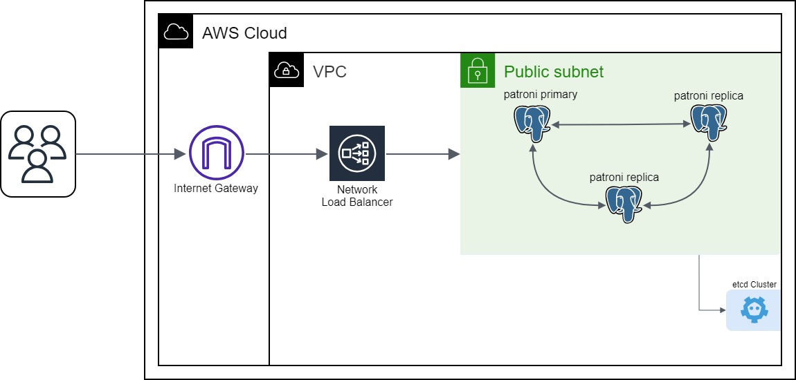
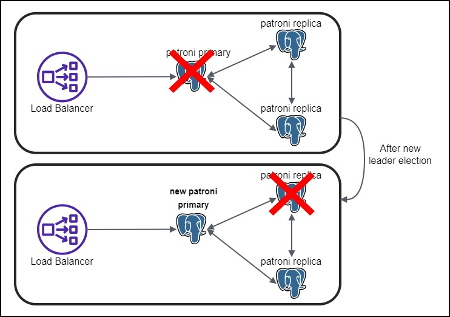

# Load Balancers: Your Key to a Highly Available PostgreSQL Cluster



In our previous blog posts, we explored how to create a strong and reliable PostgreSQL cluster using Patroni and the Spilo container image. We also covered topics like connection pooling for PostgreSQL and the use of S3 buckets for backup and recovery, all of which boosted PostgreSQL's reliability and availability. Now, as we move forward, let's dive into the next part of our journey: <b>Load Balancing</b>.

## Why Load Balancing?



In a highly available PostgreSQL cluster, load balancing is a must-have feature. There are many ways on how we can take advantage of the load balancer.

One option is to distribute the traffic across the cluster nodes. The load balancer can be configured so that it distributes read traffic across all the nodes in the cluster and write traffic to the primary node. However, in our case, we will be using the replicas as standby replicas, not active replicas. This means that the replicas will not be used for any incoming requests but rather as a failover node in case the primary node goes down.

So, the other option is to use the load balancer to determine the primary node, to which the incoming requests can be routed. If the primary node fails, the load balancer can <b>automatically</b> decide which node is the new primary and route the requests to that node. This is the approach we will be using.

## Setting up the Load Balancer

Now let's see how we can set up a load balancer for our PostgreSQL cluster. We will be using the [AWS Network Load Balancer](https://docs.aws.amazon.com/elasticloadbalancing/latest/network/introduction.html) for this purpose.

The first step is to create a new Target Group. The Target Group is a group of instances that will receive traffic from the load balancer. In our case, the Target Group will contain the instances of our PostgreSQL cluster. We will create a new Target Group called `patroni-tg` and add the instances of our PostgreSQL cluster to it. We can use the following Ansible task to create the Target Group:

```yaml
- name: Create target list
  set_fact:
    target_list: "{{ target_list | default([]) + [{'Id': item, 'Port': 6432}] }}"
    loop: "{{ ec2_instance.instance_ids }}" # The list of instance ids that will receive traffic from the load balancer

- name: Ensure Target Group for Patroni cluster exist
  community.aws.elb_target_group:
    name: patroni-tg
    region: "{{ instance_region }}"
    vpc_id: "{{ vpc_net.vpc.id }}"
    protocol: tcp
    port: 6432
    health_check_protocol: http
    health_check_path: /primary
    health_check_port: 8008
    successful_response_codes: "200" # Only forward the traffic to the primary node
    target_type: instance
    targets: "{{ target_list }}" # The list of instance ids that will receive traffic from the load balancer
    state: present
    register: tg
```

In the `health_check_port` parameter, we specify the port on which the health check will be performed. In our case, we will be using the health check endpoint provided by Patroni. The health check endpoint is available on port 8008. The `successful_response_codes` parameter specifies the response codes that are considered successful. In our case, we will only forward the traffic to the primary node, so we will only consider the response code `200` as successful. The replica nodes will return the response code `503`, which means that the node is not available to receive traffic.

Keep in mind that in this case we are using `HTTP` as the health check protocol, since the health check endpoint provided by Patroni is an HTTP endpoint. If you are using `HTTPS` as the health check protocol, you should also specify `HTTPS` in the `health_check_protocol` parameter.

The next step is to create a new Load Balancer. We will create a new Load Balancer called `patroni-nlb` and add the Target Group `patroni-tg` to it. We can use the following Ansible task to create the Load Balancer:

```yaml
- name: Ensure Network Load Balancer for Patroni cluster exist
  community.aws.elb_network_lb:
    name: patroni-nlb
    subnets:
    - "{{ patroni_subnet.subnet.id }}"
    state: present
    listeners:
    - Protocol: TCP
        Port: 6432
        DefaultActions:
        - Type: forward
            TargetGroupArn: "{{ tg.target_group_arn  }}"
```

In the `subnets` parameter, we specify the subnets in which the load balancer will be created. In our case, we will be using the subnet in which our PostgreSQL cluster is running. In the `listeners` parameter, we specify the port on which the load balancer will listen for incoming requests. In our case, we will be using port 6432, which is the port for the PgBouncer. We also specify the Target Group that will receive the incoming requests. In our case, we will be using the Target Group `patroni-tg` that we created in the previous step.

The load balancer will be assigned with a DNS name. Since we are assigning the load balancer in a public subnet, the DNS name will be publicly accessible. We can use the DNS name to connect to the PostgreSQL cluster (through the PgBouncer). To get the DNS name of the load balancer, we can navigate to the AWS console and select the load balancer or we can use the following command on your terminal:

```bash
aws elbv2 describe-load-balancers --names patroni-nlb --query 'LoadBalancers[*].DNSName' --output text
```

The output should look like this:

```bash
patroni-nlb-e81427453f1cdf1a.elb.eu-central-1.amazonaws.com
```

Now, we can connect to the Postgres database through the PgBouncer using `postgres` as the username and `zalando` (default password) as the password by running the following command:

```bash
psql -h patroni-nlb-e81427453f1cdf1a.elb.eu-central-1.amazonaws.com -U postgres -p 6432
```

After entering the correct password, you will be connected to the PostgreSQL cluster:

```bash
psql (13.4 (Ubuntu 13.4-1.pgdg20.04+1), server 13.4)
Type "help" for help.

postgres=>
```

## Wrapping Up

To sum it up, we have successfully set up a load balancer for our PostgreSQL cluster. Our approach focuses on using a network load balancer, which automatically manages traffic routing. This enhances your cluster's resilience, allowing it to handle traffic even if one node faces issues. We have also seen how we can use the load balancer to connect to the PostgreSQL cluster. Now your PostgreSQL cluster is well-prepared for any challenges that may arise. Thanks for joining us on this journey, and we hope you've found our blog posts helpful!
