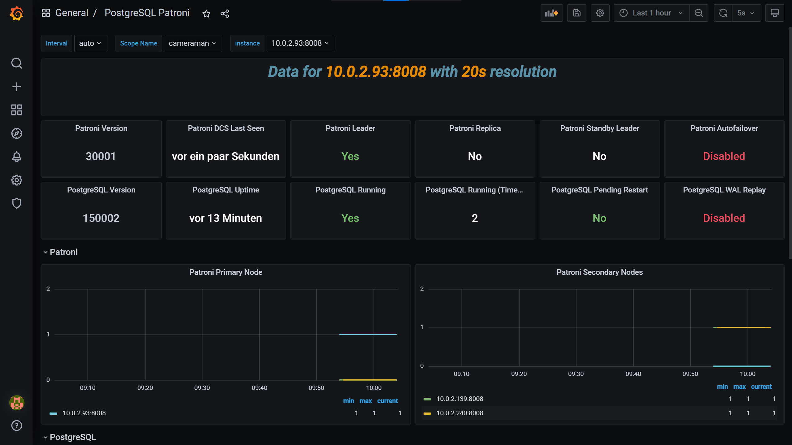

# Cluster Monitoring with Prometheus & Grafana on EC2 Instances


In the previous blog post, [Exporting metrics from etcd, PostgreSQL, PgBouncer and Patroni](./blog-Metrics-Exporter.md), we have prepared the endpoints for Prometheus to scrape metrics from etcd, PostgreSQL, PgBouncer and Patroni. In this blog post, we will use those endpoints to monitor the cluster with Prometheus and Grafana on EC2 instances.

## Prerequisites

Make sure you have followed the steps from [the previous blog](./blog-Metrics-Exporter.md) to prepare the endpoints for Prometheus to scrape metrics from etcd, PostgreSQL, PgBouncer and Patroni, since we will be using those endpoints.

## Prometheus on EC2 Instances

We will use the Ansible task from the previous blog to provision a new EC2 instance, but we will need a new Butane file, which will be attached to the instance as a user data. One of the service units in the Butane file is Prometheus, which will be executed inside a Podman container.

```yaml
- name: prometheus.service
  enabled: true
  contents: |
    [Unit]
    Description=Prometheus with Podman

    After=preparation.service

    [Service]
    User=monitoring-user
    Restart=always
    RestartSec=5s
    TimeoutStartSec=0
    LimitNOFILE=40000

    ExecStartPre=/usr/bin/loginctl enable-linger monitoring-user
    ExecStartPre=/usr/bin/podman rm -f prometheus-container
    ExecStart=/usr/bin/podman \
    run \
    --rm \
    --net=host \
    --name prometheus-container \
    --volume=/etc/ssl/self-certs:/etc/ssl/self-certs \
    --volume=/usr/local/share/prometheus.yml:/etc/prometheus/prometheus.yml \
    docker.io/prom/prometheus:v2.46.0 \
    --config.file=/etc/prometheus/prometheus.yml

    ExecStop=/usr/bin/podman rm -f prometheus-container

    [Install]
    WantedBy=multi-user.target
```

The Prometheus configuration file is located at `/usr/local/share/prometheus.yml` on the host, which will be mounted to `/etc/prometheus/prometheus.yml` inside the container. The Prometheus configuration file is as follows:

```yaml
global:
  scrape_interval: 15s
  evaluation_interval: 15s
  external_labels:
    monitor: 'ha-postgres-monitor'

scrape_configs:
- job_name: 'postgres-exporter'
  static_configs:
  - targets: ['<patroni-1-ip>:9187','<patroni-2-ip>:9187','<patroni-3-ip>:9187']
    labels:
      group: 'postgres'
  tls_config:
    ca_file: "/etc/ssl/self-certs/proventa-root-ca.pem"
    cert_file: "/etc/ssl/self-certs/proventa-client-cert.pem"
    key_file: "/etc/ssl/self-certs/proventa-client-cert-key.pem"
    insecure_skip_verify: false
  scheme: https
- job_name: 'pgbouncer-exporter'
  static_configs:
  - targets: ['<patroni-1-ip>:9127','<patroni-2-ip>:9127','<patroni-3-ip>:9127']
    labels:
      group: 'pgbouncer'
  tls_config:
    ca_file: "/etc/ssl/self-certs/proventa-root-ca.pem"
    cert_file: "/etc/ssl/self-certs/proventa-client-cert.pem"
    key_file: "/etc/ssl/self-certs/proventa-client-cert-key.pem"
    insecure_skip_verify: false
  scheme: https
- job_name: 'patroni'
  static_configs:
  - targets: ['<patroni-1-ip>:8008','<patroni-2-ip>:8008','<patroni-3-ip>:8008']
    labels:
      group: 'patroni'
  tls_config:
    ca_file: "/etc/ssl/self-certs/proventa-root-ca.pem"
    cert_file: "/etc/ssl/self-certs/proventa-client-cert.pem"
    key_file: "/etc/ssl/self-certs/proventa-client-cert-key.pem"
    insecure_skip_verify: false
  scheme: https
- job_name: 'etcd'
  static_configs:
  - targets: ['<etcd-1-ip>:2379','<etcd-2-ip>:2379','<etcd-3-ip>:2379']
    labels:
      group: 'etcd'
  tls_config:
    ca_file: "/etc/ssl/self-certs/proventa-root-ca.pem"
    cert_file: "/etc/ssl/self-certs/proventa-client-cert.pem"
    key_file: "/etc/ssl/self-certs/proventa-client-cert-key.pem"
    insecure_skip_verify: false
  scheme: https
```

The Prometheus configuration file is pretty straightforward. We have defined four jobs, each of which will scrape metrics from the endpoints of etcd, PostgreSQL (through postgres_exporter), PgBouncer (through pgbouncer_exporter) and Patroni. The endpoints are defined as targets, and the labels are used to group the metrics. The Prometheus configuration file also defines the TLS configuration for each job, since it will be scraping metrics from the endpoints through HTTPS.

That's it for Prometheus. Now, let's move on to Grafana.

## Preparing Grafana Systemd Service Unit

Let's add another systemd service unit to the Butane file, which will be used to run Grafana inside a Podman container. The service unit is as follows:

```yaml
- name: grafana.service
  enabled: true
  contents: |
    [Unit]
    Description=Grafana with Podman

    After=preparation.service

    [Service]
    User=monitoring-user
    Restart=always
    RestartSec=5s
    TimeoutStartSec=0
    LimitNOFILE=40000

    ExecStartPre=/usr/bin/loginctl enable-linger monitoring-user
    ExecStartPre=/usr/bin/podman rm -f grafana-container
    ExecStartPre=-/usr/bin/podman volume create grafana-storage
    ExecStart=/usr/bin/podman \
    run \
    --rm \
    --net=host \
    --name grafana-container \
    --volume=grafana-storage:/var/lib/grafana \
    --env=GF_SECURITY_ADMIN_PASSWORD=grafana \
    docker.io/grafana/grafana:7.5.7 \
    cfg:default.paths.data=/var/lib/grafana

    ExecStop=/usr/bin/podman rm -f grafana-container

    [Install]
    WantedBy=multi-user.target
```

First, we need to create a volume for Grafana to store its data. The volume will be created with the command `podman volume create grafana-storage`. The volume will be mounted to `/var/lib/grafana` inside the container. After that, we will run Grafana inside a Podman container. There are a lot of environment variables that can be used to configure Grafana, but for the sake of simplicity, we will only use `GF_SECURITY_ADMIN_PASSWORD` to set the password for the admin user. The Grafana container will also use a volume to store its data, which will be mounted to `/var/lib/grafana` inside the container. If you want to know more about the environment variables that can be used to configure Grafana, you can check [this page](https://grafana.com/docs/grafana/latest/installation/configure-docker/).

At this point we have prepared the Prometheus and Grafana service units. Now, we can provision a new EC2 instance running Prometheus and Grafana!

## Importing Data Source and Dashboard to Grafana with Ansible

After Prometheus and Grafana are up and running, we need to import the data source and dashboard to Grafana. We can do this with Ansible. First, we need to install the Grafana plugin for Prometheus with the command `ansible-galaxy collection install community.grafana`. After that, we can create a the tasks ti import the data source and dashboards to Grafana new Ansible playbook to import the data source and dashboard to Grafana.

The task to import the data source is as follows:

```yaml
---
- name: create prometheus datasource
    community.grafana.grafana_datasource:
    grafana_url: http://{{ item }}:3000/
    grafana_user: "admin"
    grafana_password: "{{ grafana_password }}"
    state: present
    name: Prometheus
    ds_type: prometheus
    ds_url: http://localhost:9090
    is_default: true
    with_items: "{{ monitoring_public_ip }}"
```

The task to import the dashboards is as follows:

```yaml
---
- name: Import <cluster-name> Grafana dashboards
    community.grafana.grafana_dashboard:
    grafana_url: "http://{{ item }}:3000/"
    grafana_user: "admin"
    grafana_password: "{{ grafana_password }}"
    state: present
    commit_message: Updated by ansible
    overwrite: yes
    path: "./<cluster-name>.json"
    with_items: "{{ monitoring_public_ip }}"
```

Make sure to replace `<cluster-name>` with the name of the Grafana dashboard JSON file. The JSON file for each dashboards can be downloaded from our GitHub repository [here](https://github.com/proventa/aws-postgresql-demo).

Here are some screenshots of the Grafana dashboard:

- etcd dashboard


- PostgreSQL dashboard


- PgBouncer dashboard


- Patroni dashboard



## Wrapping Up

In this blog post, we have learned how to setup monitoring for the cluster with Prometheus and Grafana on EC2 instances. We have also learned how to import the data source and dashboard to Grafana with Ansible. As maybe you have noticed, it is not that hard to prepare a monitoring system for your PostgreSQL cluster. We hope this blog post can help you to prepare a monitoring system for your PostgreSQL cluster. Stay tuned for more blog posts to extend our series.
