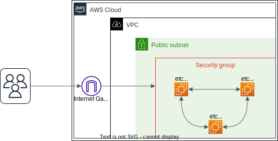

# Building a High-Availibity etcd Cluster on AWS



Welcome to the journey of building a high-availibity distributed key-value store. In this project we will build an etcd cluster inside Podman containers on AWS EC2 Instances. etcd is an open source, distributed key-value store designed for securely managing configuration data in distributed systems. Using <b>Raft</b> consensus protocol, it ensures consistent data across multiple machines. etcd is one of the most essential components for configuring management, and leader election in building reliable and highly available applications.

## Prerequisites

If you have already installed and configured Ansible and AWS CLI, you can skip the steps and go directly to the next section.

However, if you haven't, please visit the [Provisioning AWS Resources with Ansible](blog-AWS_Ansible_Combo.md) page. There you will find the steps to install and configure Ansible and AWS CLI on your local machine.

## Working with Fedora CoreOS

As the base image we will use <b>Fedora CoreOS</b>. Fedora CoreOS is an automatically updating, minimal, container-focused operating system. A big plus from Fedora CoreOS is that it comes with <b>Docker</b> and <b>Podman</b> installed. So, it is perfect for running containerized applications such as our etcd service which we will run inside a container. In Fedora CoreOS there is a file called <b>Ignition</b> file, which can be attached as the <i>user data</i> specification of our EC2 instances. This file is used to configure the instance during the boot process. However, the file is structured a little bit complex. Therefore, Fedora recommends to use <b>Butane</b> to generate the Ignition file. Butane is a more human-readable version of Fedora CoreOS' Ignition file. The structure of the file is the same as a YAML file. So, it is easier to read and understand. Let's take a better look of how the Butane file is structured and what kind of configuration we can do with it.

### The User Configuration
```yaml
variant: fcos
version: 1.5.0
passwd:
  users:
    - name: etcd-user
      ssh_authorized_keys_local:
      - /path/to/public_key.pub
```

We can create one or more users under ```passwd.users```. In this case, we have created a user called etcd-user. We can also specify the public key of the user. The public key will be used to connect to the instance via SSH. The user is not associated with any other groups. So, it is a normal (or should I say rootless) user. By default, Fedora CoreOS have provided us with a root user called core. However, we would not use the root user for running our etcd service to leverage the security of the system.

### The Storage Specification
```yaml
storage:
  files:
        - path: /etc/ssl/etcd-certs/proventa-etcd-gencert-config.json
          mode: 0644
          contents:
            local: certs/proventa-etcd-gencert-config.json

        - path: /etc/ssl/etcd-certs/proventa-etcd-root-ca-key.pem
          mode: 0644
          contents:
            local: certs/proventa-etcd-root-ca-key.pem

        - path: /etc/ssl/etcd-certs/proventa-etcd-root-ca.pem
          mode: 0644
          contents:
            local: certs/proventa-etcd-root-ca.pem

        - path: /usr/local/bin/etcd-discovery-cluster.txt
          mode: 0644
          contents:
            local: tmp/etcd-discovery-cluster.txt

        - path: /usr/local/bin/generate-client-cert.sh
          mode: 0755
          contents:
            local: generate-client-cert.sh
```

We can also specify the files that we want to copy to the instance. In this case, we are copying the etcd root CA certificate and its key, the etcd certificate generation configuration file, the discovery URL, and the script for generating the client certificate to the instance. The files will be copied to the specified path inside the instance. We can also specify the file permissions using the ```mode``` attribute. For more details about the shell scripts on how the certificates are generated, you can check our Github Repository [here](https://github.com/proventa/aws-postgresql-demo).

### The systemd Unit
```yaml
systemd:
  units:
    - name: etcd.service
      enabled: true
      contents: |
        [Unit]
        Description=etcd with Podman
        Documentation=https://github.com/coreos/etcd

        ConditionPathExists=/etc/ssl/etcd-certs/proventa-etcd-root-ca.pem
        ConditionFileNotEmpty=/etc/ssl/etcd-certs/proventa-etcd-root-ca.pem

        After=setup-network-environment.service
        Requires=setup-network-environment.service

        [Service]
        User=etcd-user
        EnvironmentFile=/etc/network-environment
        Restart=always
        RestartSec=5s
        TimeoutStartSec=0
        LimitNOFILE=40000

        ExecStartPre=-/usr/bin/loginctl enable-linger etcd-user
        ExecStartPre=/usr/bin/mkdir -p ${HOME}/etcd-data
        ExecStartPre=/usr/bin/chmod 700 ${HOME}/etcd-data
        ExecStartPre=/usr/bin/podman rm -f etcd-container
        ExecStart=/usr/bin/podman \
          run \
          --rm \
          --net=host \
          --name etcd-container \
          --volume=${HOME}/etcd-data:/etcd-data \
          --volume=/etc/ssl/etcd-certs/:/etcd-certs \
          gcr.io/etcd-development/etcd:v3.5.9 \
          /usr/local/bin/etcd \
          --name etcd-${DEFAULT_IPV4} \
          --data-dir /etcd-data \
          --listen-client-urls https://${DEFAULT_IPV4}:2379,http://127.0.0.1:2379 \
          --advertise-client-urls https://${DEFAULT_IPV4}:2379 \
          --listen-peer-urls https://${DEFAULT_IPV4}:2380 \
          --initial-advertise-peer-urls https://${DEFAULT_IPV4}:2380 \
          --client-cert-auth \
          --cert-file /etcd-certs/proventa-etcd-client-cert.pem \
          --key-file /etcd-certs/proventa-etcd-client-cert-key.pem \
          --trusted-ca-file /etcd-certs/proventa-etcd-root-ca.pem \
          --peer-client-cert-auth \
          --peer-cert-file /etcd-certs/proventa-etcd-client-cert.pem \
          --peer-key-file /etcd-certs/proventa-etcd-client-cert-key.pem \
          --peer-trusted-ca-file /etcd-certs/proventa-etcd-root-ca.pem \
          --discovery=${ETCD_DISCOVERY_ADDR}

        ExecStop=/usr/bin/podman rm -f etcd-container

        [Install]
        WantedBy=multi-user.target
```

The last part of the Butane file is the ```systemd``` section. Here we can specify the systemd units that we want to run inside the instance. In this case, we are running the etcd service. The ```name``` attribute is used to specify the name of the systemd unit. The ```enabled``` attribute is used to specify whether the unit should be enabled or not on boot. The ```contents``` attribute is used to specify the content of the systemd unit. The ```Requires``` attribute serves the purpose of specifying the units that are required by the etcd service. The ```After``` attribute is used to specify the units that should be started before the etcd service. We have a unit called <b>setup-network-environment.service</b>. It runs a script for setting up the network environment. The setup-network-environment.service was provided by Kelsey Hightower and the source code can be found [here](https://github.com/kelseyhightower/setup-network-environment). What it does, is, it creates a file called <b>network-environment</b> that contains the IP address of the EC2 instance that will be used for our etcd service. Now, let's take a deeper look at the etcd.service.

Under ```[Service]``` we can see that ```User``` is set to etcd-user and ```EnvironmentFile``` is set to /etc/network-environment. It means that the service will be run as the etcd-user and the environment variables will be read from the /etc/network-environment file. The ```ExecStartPre``` will create a directory called etcd-data inside the home directory of the etcd-user. This is the directory which will be mounted to the /etcd-data directory inside the container, where the etcd data will be stored. The ```ExecStart``` will run the etcd service inside a podman container.

There are several flags used in ```ExecStart```, but I will mention some that could be interesting to know. We specified the root CA certificate, client certificate and its key generated by the shell script with the ```--trusted-ca-file```, ```--cert-file```, and ```--key-file``` flags. We are also applying the same flags but with the prefix ```--peer```. The certificates are used to ensure that the etcd nodes can securely communicate with each other and with the clients over HTTPS. Notice that we are not using ```--initial-cluster``` flag because we are using the discovery URL to bootstrap the cluster.  The ```--discovery``` flag is used to specify the discovery URL. It is an amazing feature provided by etcd to simplify the process of bootstrapping a new cluster. The etcd nodes can automatically join the cluster by using the discovery URL. Therefore we don't need to know the IP address of the other nodes in advance. The ```ExecStop``` will remove the etcd-container after the etcd service is stopped. 

### Compiling the Butane File

Now that we have a better understanding of the Butane file, let's create the file. We will create a file called <b>etcd-cluster.yaml</b> and put the content of the Butane file inside it. Then, we can compile the Butane file into a Ignition file (.ign) using the following command.

```bash
podman run --interactive --rm --security-opt label=disable --volume ${PWD}:/pwd --workdir /pwd quay.io/coreos/butane:release -d /pwd --pretty --strict etcd-cluster.yaml > etcd.ign
```

The Ignition file will be created in the same directory as the Butane file. Now, we can use the Ignition file as the user data specification of our EC2 instances. 

## Spining Up the etcd Service on EC2 Instances
You can take the Ansible Playbook from the [previous blog post](blog-AWS_Ansible_Combo.md) to provision the EC2 instances. However, we need to make some changes to the ```Create EC2 instances``` task. Here is the updated task.

```yaml
    - name: Create EC2 instances
      amazon.aws.ec2_instance:
        state: running
        instance_type: t2.micro
        image_id: ami-01616b3a6ec881521 # Fedora CoreOS
        count: 3
        region: eu-central-1
        network:
          assign_public_ip: true
        security_group: "{{ etcd_sg.group_name }}"
        vpc_subnet_id: "{{ etcd_subnet.subnet.id }}"
        key_name: "{{ key_pair.key.name }}"
        user_data: "{{ lookup('file', 'etcd.ign')|string }}" # Use the Ignition file as the user data
        tags: 
          env: demo
```

We have added the ```user_data``` attribute and set it to the Ignition file. It will take our Ignition file and run the configuration we have specified earlier during the boot process. Now, we can run the playbook to provision the EC2 instances!

```bash
ansible-playbook provision.yml
```

## Verifying the etcd Cluster

Let the machine run for a while until the status of the instances are changed to <b>running</b>. Then, we can SSH into one of the instances using the following command.

```bash
ssh -i /path/to/private_key etcd-user@<public_ip>
```

Since we are logging in as a non-root user, we can't run the ```sudo``` command to check the service unit. So, we can verify that the etcd service is running by checking the status of the etcd-container or the logs of the container. We can do that by running the following command.

```bash
podman ps # Check the status of the container
```

The output should be something like this.

```bash
CONTAINER ID  IMAGE                                              COMMAND               CREATED         STATUS             PORTS  NAMES
b0b2e2e2e2e2  gcr.io/etcd-development/etcd:v3.5.9                /usr/local/bin/etcd   2 minutes ago   Up 2 minutes ago          etcd-container
```

Now that we have verified that the etcd service container is running, we can check the members of the cluster by running the following command.

```bash
podman exec -it etcd-container etcdctl --write-out=table member list
```

The output should look like this:

```bash
+------------------+---------+---------------------------+---------------------------+---------------------------+------------------+------------+
|        ID        | STATUS  |          NAME             |        PEER ADDRS         |       CLIENT ADDRS        | IS LEARNER       | RAFT TERM  |
+------------------+---------+---------------------------+---------------------------+---------------------------+------------------+------------+
|  1f0b3b2b3b3b3b3 | started | etcd-1f0b3b2b3b3b3b       | https://1.x.xx.xx:2380    | https://1.x.xx.xx:2379    | false            |          2 |
|  2f0b3b2b3b3b3b3 | started | etcd-2f0b3b2b3b3b3b       | https://2.x.xx.xx:2380    | https://2.x.xx.xx:2379    | false            |          2 |
|  3f0b3b2b3b3b3b3 | started | etcd-3f0b3b2b3b3b3b       | https://3.x.xx.xx:2380    | https://3.x.xx.xx:2379    | false            |          2 |
+------------------+---------+---------------------------+---------------------------+---------------------------+------------------+------------+
```

We will take the addresses in the `CLIENT ADDRS` column and save it into a variable called `ENDPOINTS`. We can do that by running the following command:

```bash
ENDPOINTS=$(podman exec etcd-container etcdctl member list | awk -F ', ' '{print $5}' | tr '\n' ',' | sed 's/.$//')
```

Then we can check the status and the health of the etcd cluster by running the following command:
```bash
podman exec -it etcd-container etcdctl --write-out=table --cacert="/etcd-certs/proventa-etcd-root-ca.pem"  --endpoints=$ENDPOINTS --cert="/etcd-certs/proventa-etcd-client-cert.pem" --key="/etcd-certs/proventa-etcd-client-cert-key.pem" endpoint status
podman exec -it etcd-container etcdctl --write-out=table --cacert="/etcd-certs/proventa-etcd-root-ca.pem"  --endpoints=$ENDPOINTS --cert="/etcd-certs/proventa-etcd-client-cert.pem" --key="/etcd-certs/proventa-etcd-client-cert-key.pem" endpoint health
```

The output should look like this:

```bash
+---------------------------+------------------+---------+---------+-----------+------------+-----------+------------+--------------------+-------+
|         ENDPOINT          |        ID        | VERSION | DB SIZE | IS LEADER | IS LEARNER | RAFT TERM | RAFT INDEX | RAFT APPLIED INDEX | ERROR |
+---------------------------+------------------+---------+---------+-----------+------------+-----------+------------+--------------------+-------+
| https://1.x.xx.xx:2379    |  1f0b3b2b3b3b3b3 |  3.5.9  |   20 kB |      true |      false |         2 |         10 |                 10 |       |
| https://2.x.xx.xx:2379    |  2f0b3b2b3b3b3b3 |  3.5.9  |   20 kB |     false |      false |         2 |         10 |                 10 |       |
| https://3.x.xx.xx:2379    |  3f0b3b2b3b3b3b3 |  3.5.9  |   20 kB |     false |      false |         2 |         10 |                 10 |       |
+---------------------------+------------------+---------+---------+-----------+------------+-----------+------------+--------------------+-------+

+---------------------------+--------+------+-------+
|         ENDPOINT          | HEALTH | TOOK | ERROR |
+---------------------------+--------+------+-------+
| https://1.x.xx.xx:2379    |   true |  2ms |       |
| https://2.x.xx.xx:2379    |   true |  2ms |       |
| https://3.x.xx.xx:2379    |   true |  2ms |       |
+---------------------------+--------+------+-------+
```

With that we can see that the etcd cluster is up and running.

## Wrapping Up

Congratulations on successfully setting up a high-availability etcd cluster on AWS using Ansible, Fedora CoreOS, and Podman! You've learned how to create and configure EC2 instances with custom Ignition files, run etcd inside containers, and ensure the reliability of your distributed key-value store. Thank you for joining me in this journey of building a high-availability etcd cluster on AWS. Remember that learning and exploration are continuous processes, and the tech landscape is ever-evolving. Stay tune for more exciting projects!

## Links
- [AWS PostgreSQL Demo Github Repository](https://github.com/proventa/aws-postgresql-demo)
- [etcd.io](https://etcd.io/)
- [Amazon Web Services](https://aws.amazon.com/)
- [Ansible](https://www.ansible.com/)
- [Fedora CoreOS](https://fedoraproject.org/coreos/)
- [Podman](https://podman.io/)