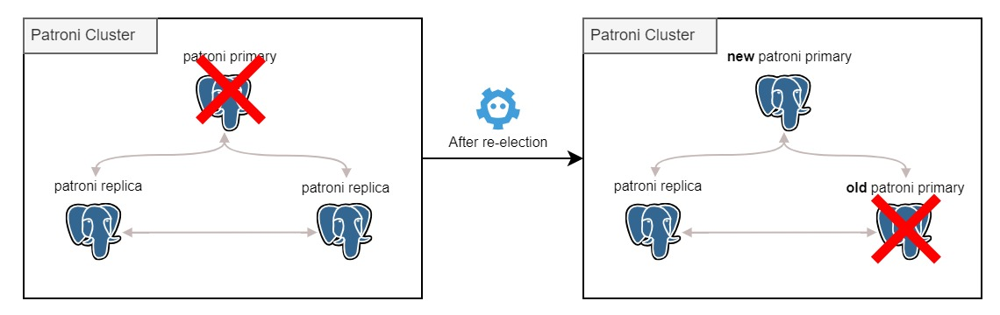

# Ensuring High Availability with Patroni: Handling Failover



Nowadays, high availability and data integrity are the most important things in the database world. Downtime and data loss can be very expensive for any company. One way to avoid this is by having a failover mechanism. Failover is a mechanism that allows a system to continue operating, possibly at a reduced level, rather than failing completely when some part of the system fails. In this article, we will discuss how Patroni handles failover.

## Prerequisites

A fully functioning PostgreSQL Cluster based on Patroni with backups. If you don't have one, you can follow [one of our previous blog post](./blog-Running_Spilo.md) to set up a PostgreSQL Cluster based on Patroni.

## Patroni Failover

Patroni uses a distributed consensus algorithm component, such as etcd, ZooKeeper, or Consul, to elect a leader node among the database cluster nodes. The leader node is responsible for handling write requests, while the standby nodes replicate data from the leader to ensure data redundancy. If the leader node fails, the standby nodes will elect a new leader and continue to serve write requests.

### Case 1: Leader Node Failure

In this section we will simulate a leader node failure and see how Patroni handles it. In one of the previous blog posts, we have deployed a 3-nodes PostgreSQL cluster on AWS EC2 instances. Now, we should check, whether all the nodes are currently running and healthy. We can do that by logging in to one of the nodes and then running the following command:

```bash
podman exec -it patroni-container patronictl list
```

The output should be similar to the following:

```bash
+ Cluster: superman (101010101010101010) ---+----+-----------+
| Member   | Host        | Role    | State    | TL | Lag in MB |
+----------+-------------+---------+----------+----+-----------+
| ec2-id-1 | 1.x.x.x     | Leader  | running  |  1 |           |
| ec2-id-2 | 2.x.x.x     | Replica | running  |  1 |         0 |
| ec2-id-3 | 3.x.x.x     | Replica | running  |  1 |         0 |
+----------+-------------+---------+----------+----+-----------+
```

If all nodes are on `running` state, then we can proceed to the next step.

Now, we will simulate a leader node failure by stopping the PostgreSQL service on the leader node. We can just terminate the EC2 instance that is running the leader node. In the `member` column, we can see that the leader node is `ec2-id-1`. So, we will terminate the EC2 instance with ID `ec2-id-1`.

If you want to check directly the status of the cluster, you would see that the cluster does not have a leader node anymore. This is because the leader is down and the standby nodes are still trying to elect a new leader. We can check the status of the cluster by running the following command:

```bash
podman exec -it patroni-container patronictl list
```

The output should be similar to the following:

```bash
+ Cluster: superman (101010101010101010) ---+----+-----------+
| Member   | Host        | Role    | State    | TL | Lag in MB |
+----------+-------------+---------+----------+----+-----------+
| ec2-id-2 | 2.x.x.x     | Replica | running  |  1 |         0 |
| ec2-id-3 | 3.x.x.x     | Replica | running  |  1 |         0 |
+----------+-------------+---------+----------+----+-----------+
```

After a few moments, the leader node will be elected. We can check the status of the cluster by running the same command as before. The output should be similar to the following, if the leader node has been elected:

```bash
+ Cluster: superman (101010101010101010) ---+----+-----------+
| Member   | Host        | Role    | State    | TL | Lag in MB |
+----------+-------------+---------+----------+----+-----------+
| ec2-id-2 | 2.x.x.x     | Replica | running  |  2 |         0 |
| ec2-id-3 | 3.x.x.x     | Leader  | running  |  2 |           |
+----------+-------------+---------+----------+----+-----------+
```

### Case 2: Cluster Failure

In this section we will simulate a cluster failure and see how Patroni handles it. This would be the extreme case, where all the nodes in the cluster are down. Like the case before, we need a fully functioning PostgreSQL cluster based on Patroni. We can use the same cluster as before. Also, keep in mind that the cluster should have a backup. Spilo offers a WAL-E/WAL-G backup mechanism, which we will use in this example. If you don't have a backup, you can follow one of our previous blog post, [Backing up & Restoring a Highly Available PostgreSQL Cluster with S3](./blog-Backup-Restore.md), to set up a backup WAL-G mechanism in Spilo container image.

Now, we will simulate a cluster failure by stopping all the PostgreSQL services. We can just terminate all the EC2 instances that are running the PostgreSQL service. In the `member` column, we can see that we have 2 members left, which are `ec2-id-2` and `ec2-id-3`. So, we will terminate the EC2 instances with ID `ec2-id-2` and `ec2-id-3`.

At this point, you should only have the EC2 instances that are running the etcd service.

Now, we will provision 3 nodes with the same Patroni/Spilo configuration as before. We can do that by running the ansible playbook that we have used before. The command should be similar to the following:

```bash
ansible-playbook init-patroni-cluster.yml
```

After the playbook has finished running, we can log in to one of the nodes and then check the status of the cluster by running the same command as before, which is:

```bash
podman exec -it patroni-container patronictl list
```

However, if you are too fast, you would see that the cluster does not have a leader node yet. This is because the standby nodes are still trying to elect a new leader. After a few moments, we can check the status of the cluster by running the same command as before. The output should be similar to the following, if the leader node has been elected:

```bash
+ Cluster: superman (101010101010101010) ---+----+-----------+
| Member    | Host        | Role    | State    | TL | Lag in MB |
+-----------+-------------+---------+----------+----+-----------+
| new-ec2-1 | 2.x.x.x     | Leader  | running  |  3 |           |
| new-ec2-2 | 3.x.x.x     | Replica | running  |  3 |         0 |
| new-ec2-3 | 4.x.x.x     | Replica | running  |  3 |         0 |
+-----------+-------------+---------+----------+----+-----------+
```

Notice that now the TL (Timeline) has increased from 2 to 3. This is because the cluster has been restored from the backup and a new leader node has been elected.

## Conclusion

In this blog post, we have discussed how Patroni handles failover. We have simulated 2 cases, which are leader node failure and cluster failure. We have also seen how Patroni reacts to those cases. The best thing is that Patroni can handle those cases automatically, without any human intervention! This is very useful, especially in a production environment, where downtime and data loss can be very expensive. We hope that this blog post can help you to understand Patroni failover mechanism better.
